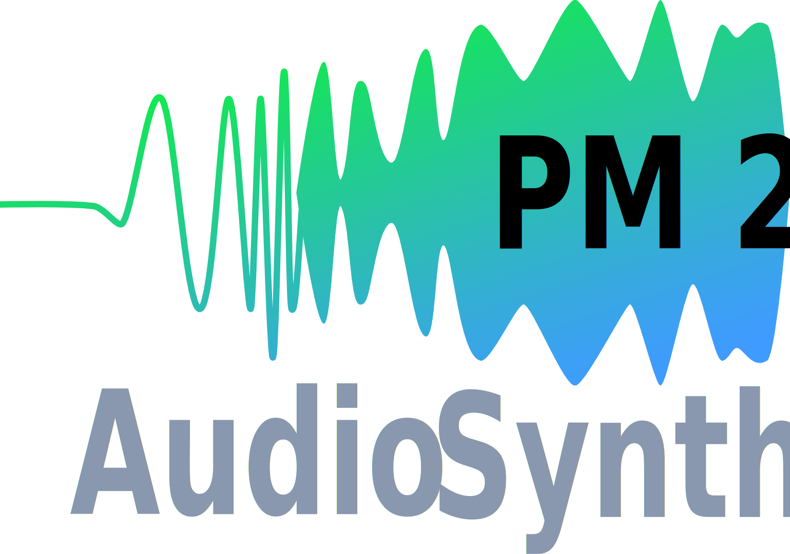

<div id="top"></div>

<!-- PROJECT SHIELDS -->
<!--
*** I'm using markdown "reference style" links for readability.
*** Reference links are enclosed in brackets [ ] instead of parentheses ( ).
*** See the bottom of this document for the declaration of the reference variables
*** for contributors-url, forks-url, etc. This is an optional, concise syntax you may use.
*** https://www.markdownguide.org/basic-syntax/#reference-style-links
-->
[![Contributors][contributors-shield]][contributors-url]
[![Forks][forks-shield]][forks-url]
[![Stargazers][stars-shield]][stars-url]
[![Issues][issues-shield]][issues-url]
[![MIT License][license-shield]][license-url]
[![LinkedIn][linkedin-shield]][linkedin-url]


<!-- PROJECT LOGO -->
<br />
<div align="center">
  <a href="https://github.com/camentho/PM2_Audio_Synthesizer">
    
  </a>

<h3 align="center">PM2 Audio Synthesizer</h3>

  <p align="center">
    Source code to create an Audio synthesizer with the intel development board <a href="https://www.intel.com/content/dam/www/programmable/us/en/portal/dsn/42/doc-us-dsnbk-42-2912030810549-de10-lite-user-manual.pdf"> DE10-Lite</a>, and symulation files for Altera modelsym
    <br />
    <a href="https://github.com/camentho/PM2_Audio_Synthesizer"><strong>Explore the docs »</strong></a>
    <br />
    <br />
    <a href="https://github.com/camentho/PM2_Audio_Synthesizer">View Demo</a>
    ·
    <a href="https://github.com/camentho/PM2_Audio_Synthesizer/issues">Report Bug</a>
    ·
    <a href="https://github.com/camentho/PM2_Audio_Synthesizer/issues">Request Feature</a>
  </p>
</div>


<!-- TABLE OF CONTENTS -->
<details>
  <summary>Table of Contents</summary>
  <ol>
    <li>
      <a href="#about-the-project">About The Project</a>
      <ul>
        <li><a href="#built-with">Built With</a></li>
      </ul>
    </li>
    <li>
      <a href="#getting-started">Getting Started</a>
      <ul>
        <li><a href="#prerequisites">Prerequisites</a></li>
        <li><a href="#installation">Installation</a></li>
      </ul>
    </li>
    <li><a href="#usage">Usage</a></li>
    <li><a href="#roadmap">Roadmap</a></li>
    <li><a href="#contributing">Contributing</a></li>
    <li><a href="#license">License</a></li>
    <li><a href="#contact">Contact</a></li>
    <li><a href="#acknowledgments">Acknowledgments</a></li>
  </ol>
</details>


<!-- ABOUT THE PROJECT -->
## About The Project

[![Product Name Screen Shot][product-screenshot]](https://example.com)

All code is written in Hardware Description Language to be compiled fo the intel development board 

<p align="right">(<a href="#top">back to top</a>)</p>


### Built With

* [Quartus Prime Lite Edition](https://www.intel.com/content/www/us/en/software/programmable/quartus-prime/download.html)

<p align="right">(<a href="#top">back to top</a>)</p>


<!-- GETTING STARTED -->
## Getting Started

Due to the included Quartus and Simulation files, getting started is rather straightforward. If the files do not load correctly follow the steps below

### Prerequisites
Listed are the programs used in the development, source code might compile on other platforms, but functionality is not guaranteed

To compile the project:
* [Quartus Prime Lite Edition](https://www.intel.com/content/www/us/en/software/programmable/quartus-prime/download.html)
	- [Version 20.1.1 or above](https://www.intel.com/content/www/us/en/collections/products/fpga/software/downloads.html?edition=standard&s=Newest&f:guidetmD240C377263B4C70A4EA0E452D0182CA=[Intel%C2%AE%20Quartus%C2%AE%20Prime%20Design%20Software;Intel%C2%AE%20Quartus%C2%AE%20Prime%20Lite%20Edition;20.1.1])

To simulate:
* Altera ModelSim
  - Version 2020 or newer

### Cloning the project

1. Clone the repo
   ```sh
   git clone https://github.com/camentho/PM2_Audio_Synthesizer.git
   ```

### Compile on Quartus

1. Open Project
   - Double click
   ```path
   PM2_Audio_Synthesizer/quartus/synthi_top.qpf
   ```
2. Compile
   - Click `Start Compilation` or use shortcut
   `Ctrl + L`

3. Program DE10-Lite
   - Click `Programmer` in main options tab
   - Follow wizzard

### Runn symulation on ModelSim

1. Open Project
   - Double click
   ```path
   PM2_Audio_Synthesizer/simulations/synthi_top.mpf
   ```
2. Move to correct symulation path
   - In application console type:
   ```sh
   cd /synthi_top_tb/modelsim
   ```
2. Run simulation
   ```sh
   do ../compile.do
   ```

<p align="right">(<a href="#top">back to top</a>)</p>


<!-- USAGE EXAMPLES -->
## Usage

Use this space to show useful examples of how a project can be used. Additional screenshots, code examples and demos work well in this space. You may also link to more resources.

_For more examples, please refer to the [Documentation](https://example.com)_

<p align="right">(<a href="#top">back to top</a>)</p>


<!-- ROADMAP -->
## Roadmap

- [x] Milestone 1
- [x] Milestone 2
- [x] Milestone 3
- [ ] Milestone 4
- [ ] User interface
  - [ ] Bonus Freatures

See the [open issues](https://github.com/camentho/PM2_Audio_Synthesizer/issues) for a full list of proposed features (and known issues).

<p align="right">(<a href="#top">back to top</a>)</p>


<!-- CONTRIBUTING -->
## Contributing

This project is developed by team 2

<!-- readme: contributors -start -->
<table>
<tr>
    <td align="center">
        <a href="https://github.com/camentho">
            
            <br />
            <sub><b>Camentho</b></sub>
        </a>
    </td>
    <td align="center">
        <a href="https://github.com/RafaelRoser">
            
            <br />
            <sub><b>RafaelRoser</b></sub>
        </a>
    </td></tr>
</table>
<!-- readme: contributors -end -->

<p align="right">(<a href="#top">back to top</a>)</p>


<!-- LICENSE -->
## License

Distributed under the ZHAW License. See `LICENSE.txt` for more information.

<p align="right">(<a href="#top">back to top</a>)</p>


<!-- CONTACT -->
## Contact

Camenzind Thomas - camentho@students.zhaw.ch

Roser Raffael - roserraf@students.zhaw.ch

Project Link: [https://github.com/camentho/PM2_Audio_Synthesizer](https://github.com/camentho/PM2_Audio_Synthesizer)

<p align="right">(<a href="#top">back to top</a>)</p>


<!-- ACKNOWLEDGMENTS -->
## Acknowledgments

* [ZHAW](https://www.zhaw.ch)
* []()
* []()

<p align="right">(<a href="#top">back to top</a>)</p>


<!-- MARKDOWN LINKS & IMAGES -->
<!-- https://www.markdownguide.org/basic-syntax/#reference-style-links -->
[contributors-shield]: https://img.shields.io/github/contributors/camentho/PM2_Audio_Synthesizer.svg?style=for-the-badge
[contributors-url]: https://github.com/camentho/PM2_Audio_Synthesizer/graphs/contributors
[forks-shield]: https://img.shields.io/github/forks/camentho/PM2_Audio_Synthesizer.svg?style=for-the-badge
[forks-url]: https://github.com/camentho/PM2_Audio_Synthesizer/network/members
[stars-shield]: https://img.shields.io/github/stars/camentho/PM2_Audio_Synthesizer.svg?style=for-the-badge
[stars-url]: https://github.com/camentho/PM2_Audio_Synthesizer/stargazers
[issues-shield]: https://img.shields.io/github/issues/camentho/PM2_Audio_Synthesizer.svg?style=for-the-badge
[issues-url]: https://github.com/camentho/PM2_Audio_Synthesizer/issues
[license-shield]: https://img.shields.io/github/license/camentho/PM2_Audio_Synthesizer.svg?style=for-the-badge
[license-url]: https://github.com/camentho/PM2_Audio_Synthesizer/blob/master/LICENSE.txt
[linkedin-shield]: https://img.shields.io/badge/-LinkedIn-black.svg?style=for-the-badge&logo=linkedin&colorB=555
[linkedin-url]: https://linkedin.com/in/linkedin_username
[product-screenshot]: images/screenshot.png
